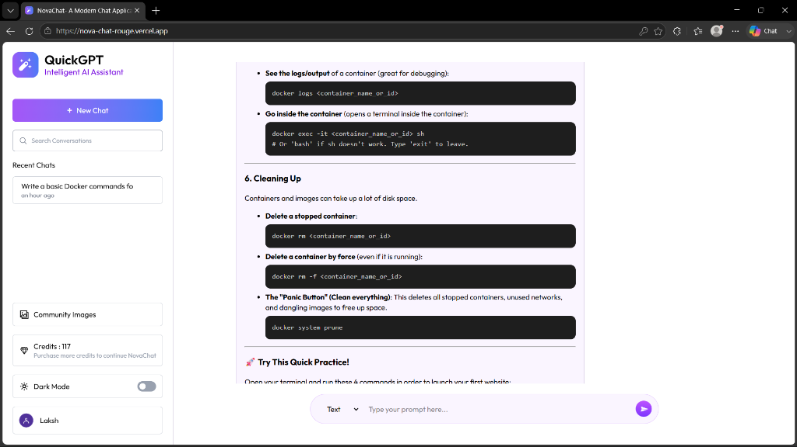
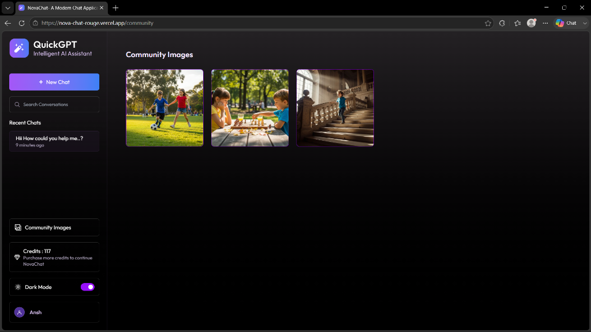
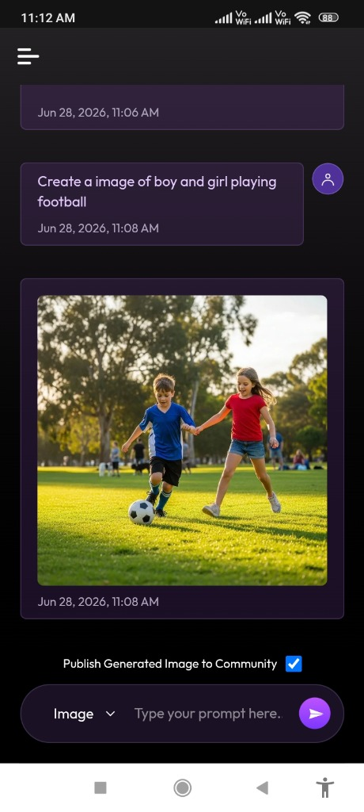
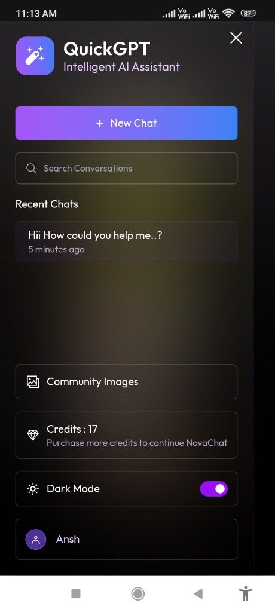

# <p align="center"><br>NovaChat - Smart AI Chatbot & Generator</p>

<p align="center">
  <a href="https://nova-chat-rouge.vercel.app" target="_blank">
    
  </a>
  
  
  
</p>

NovaChat is a full-featured MERN stack conversational AI assistant and creative image generator inspired by ChatGPT. Built using modern web standards, it integrates Google Gemini's advanced language modeling with ImageKit's text-to-image AI capabilities, complete with custom user authentication, a live community gallery, and a credit-based subscription economy secured by Stripe Payments.

---

## 🌐 Live Application
Experience NovaChat in production: **[NovaChat Live on Vercel](https://nova-chat-rouge.vercel.app)**

---

## 📸 Screenshots

### 🖥️ Desktop Interface
<table width="100%">
  <tr>
    <td width="50%" align="center">
      <p align="center"><b>💬 Desktop Chat Interface (Light Mode)</b></p>
      
    </td>
    <td width="50%" align="center">
      <p align="center"><b>🎨 Community Gallery (Dark Mode)</b></p>
      
    </td>
  </tr>
</table>

### 📱 Mobile Interface
<table width="100%">
  <tr>
    <td width="50%" align="center">
      <p align="center"><b>🤖 Mobile Chat & AI Image Generation</b></p>
      
    </td>
    <td width="50%" align="center">
      <p align="center"><b>⚙️ Collapsible Menu & Credits System</b></p>
      
    </td>
  </tr>
</table>

---

## ✨ Core Features

- 🤖 **Dual-Mode AI Assistant**:
  - **Text Mode**: Chat with an intelligent assistant powered by Google Gemini (via OpenAI-compatible API endpoints).
  - **Image Mode**: Generate unique high-resolution images from textual descriptions in real-time, powered by ImageKit's AI text-to-image generator.
- 💳 **Credit-Based Economy & Subscriptions**:
  - New users start with **20 free credits**.
  - Text prompts deduct **1 credit**.
  - Image generation prompts deduct **2 credits**.
  - Built-in payment packages (Basic, Pro, Premium) integrated with Stripe checkout.
- ⚡ **Real-Time Webhook Processing**: Transactions are dynamically verified using Stripe Webhooks (`payment_intent.succeeded`) to instantly load credits to user accounts.
- 🎨 **Community Gallery**: Users can optionally publish their AI-generated designs to a global community page for everyone to see and explore.
- 🔑 **Secure Authentication**: Traditional JWT registration and login with bcrypt password hashing.
- 🌓 **Theme Customization**: Responsive dark and light theme options with local storage persistence.
- 📝 **Markdown & Code Highlight Rendering**: Responses dynamically parse and highlight structural code blocks using `react-markdown` and `prismjs`.

---

## 🛠️ Tech Stack

### Frontend
- **Framework**: [React 19](https://react.dev/) + [Vite](https://vitejs.dev/)
- **Styling**: [Tailwind CSS 4](https://tailwindcss.com/)
- **Routing**: [React Router 7](https://reactrouter.com/)
- **Formatting & Syntax**: `react-markdown` & `prismjs`
- **Utility Libraries**: `axios`, `moment`, `react-hot-toast`, `react-icons`

### Backend
- **Runtime**: [Node.js](https://nodejs.org/) + [Express 5](https://expressjs.com/)
- **Database**: [MongoDB Atlas](https://www.mongodb.com/atlas/database) + [Mongoose 9](https://mongoosejs.com/)
- **Generative AI**: [Google Gemini API](https://ai.google.dev/) (utilizing OpenAI Node SDK integration)
- **Image Storage & AI Gen**: [ImageKit.io SDK](https://imagekit.io/)
- **Payments Platform**: [Stripe SDK](https://stripe.com/)
- **Security & Tokens**: `bcryptjs` & `jsonwebtoken`

---

## 🗄️ Database Schemas

### 1. User Schema (`User.js`)
```javascript
const userSchema = new mongoose.Schema({
  name: { type: String, required: true },
  email: { type: String, required: true, unique: true },
  password: { type: String, required: true },
  credits: { type: Number, default: 20 }
});
```

### 2. Chat Schema (`Chat.js`)
```javascript
const ChatSchema = new mongoose.Schema({
  userId: { type: String, ref: "User", required: true },
  userName: { type: String, required: true },
  name: { type: String, required: true },
  messages: [{
    isImage: { type: Boolean, required: true },
    isPublished: { type: Boolean, default: false },
    role: { type: String, required: true },
    content: { type: String, required: true },
    timestamp: { type: Number, required: true }
  }]
}, { timestamps: true });
```

### 3. Transaction Schema (`Transaction.js`)
```javascript
const transactionSchema = new mongoose.Schema({
  userId: { type: mongoose.Schema.Types.ObjectId, ref: 'User', required: true },
  planId: { type: String, required: true },
  amount: { type: Number, required: true },
  credits: { type: Number, required: true },
  isPaid: { type: Boolean, default: false }
}, { timestamps: true });
```

---

## ⚡ Stripe Subscription Plans

| Plan | Price (USD) | Credits | Features |
| :--- | :--- | :--- | :--- |
| **Basic** | \$10 | 100 | 100 text prompts / 50 images, standard support |
| **Pro** | \$20 | 500 | 500 text prompts / 200 images, priority support |
| **Premium** | \$30 | 1000 | 1000 text prompts / 500 images, 24/7 VIP support |

---

## 🚀 Installation & Setup

### Prerequisites
- Node.js installed locally
- MongoDB Atlas cluster URL
- Gemini API Key
- ImageKit account (PublicKey, PrivateKey, URL Endpoint)
- Stripe Developer Account (SecretKey, WebhookSecret)

### 1. Clone & Set Up the Backend
Navigate to the `server` directory and install dependencies:
```bash
cd server
npm install
```

Create a `.env` file in the `server` root:
```env
PORT=3000
MONGODB_URI=your_mongodb_connection_uri
JWT_SECRET=your_jwt_secret_token
GEMINI_API_KEY=your_gemini_api_key

# ImageKit Keys
IMAGEKIT_PUBLIC_KEY=your_imagekit_public_key
IMAGEKIT_PRIVATE_KEY=your_imagekit_private_key
IMAGEKIT_URL_ENDPOINT=your_imagekit_url_endpoint

# Stripe Keys
STRIPE_PUBLISHABLE_KEY=your_stripe_publishable_key
STRIPE_SECRET_KEY=your_stripe_secret_key
STRIPE_WEBHOOK_SECRET=your_stripe_webhook_signing_secret
```

Start the backend development server:
```bash
npm run dev
```

### 2. Set Up the Client
Navigate to the `client` directory and install dependencies:
```bash
cd ../client
npm install
```

Create a `.env` file in the `client` root:
```env
VITE_SERVER_URL=http://localhost:3000
```

Start the client development server:
```bash
npm run dev
```

---

## 🔗 API Endpoints

### 🔑 User Authentication
* `POST /api/user/register` - Create user account
* `POST /api/user/login` - User login & token exchange
* `GET /api/user/data` - Retrieve logged-in user context
* `GET /api/user/published-images` - Fetch community shared gallery images

### 💬 Conversational Chats
* `GET /api/chat/create` - Instantiate new chat window session
* `GET /api/chat/get` - Fetch all recent user chats

### ✉️ Messaging Engine
* `POST /api/message/text` - Submit prompt to assistant (costs 1 credit)
* `POST /api/message/image` - Submit prompt to ImageKit AI image generator (costs 2 credits)

### 💳 Stripe & Billing
* `GET /api/credit/plan` - Fetch credit pricing models
* `POST /api/credit/purchase` - Initialize Stripe Checkout session
* `POST /api/stripe` - Raw stripe webhook signature verification router
